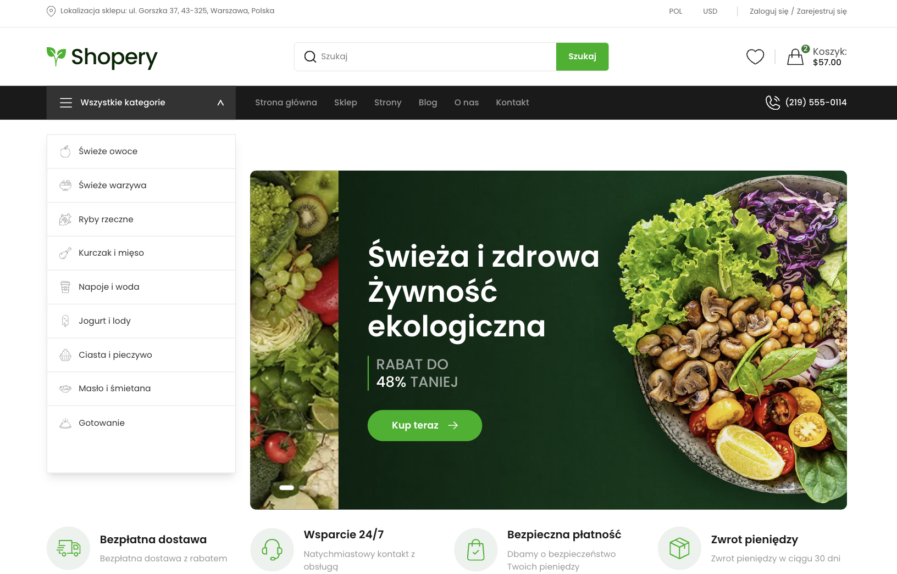
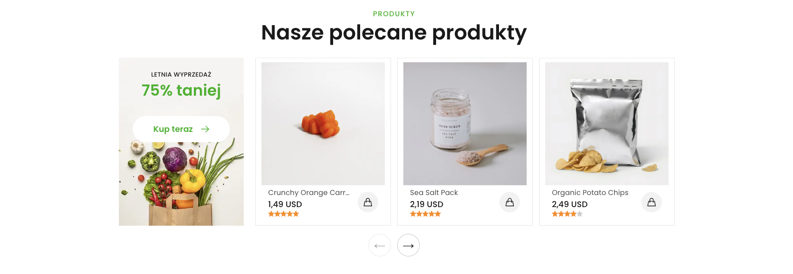
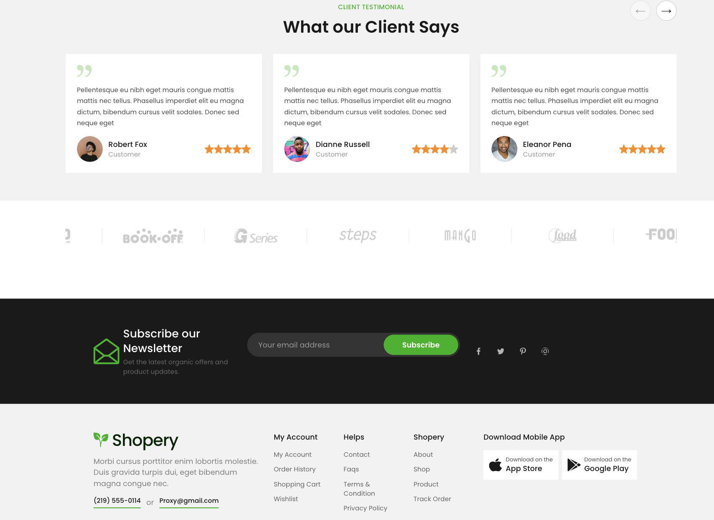

# 🛒 Organic Shop

🚧 **Work in Progress** - this project is currently under active development.

A full-stack e-commerce application built with **Next.js, TypeScript, PostgreSQL, and Drizzle ORM**.

The project is focused on building a realistic online shopping experience using modern frontend and full-stack web technologies.

## 🌐 Live Demo

🔗 [Open Organic Shop](https://organic-shop-snowy.vercel.app/)

---

## 📸 Preview

### Homepage Hero and Navigation

  

### Featured Products

  

### Testimonials and Footer

  

---

## 🛠 Tech Stack

### Frontend

- **Next.js 16**
- **React 19**
- **TypeScript**
- **Tailwind CSS 4**
- **next-intl**
- **Zustand**
- **Embla Carousel**

### Backend & Data

- **PostgreSQL on Neon**
- **Drizzle ORM**
- **Upstash Redis**

### Development Tools & Code Quality

- **Git & GitHub**
- **Vercel**
- **ESLint**
- **Prettier**
- **Husky**
- **Codex**

---

## ✨ Current Functionality

- Responsive localized homepage
- English and Polish language switching
- USD and PLN price display with a persisted currency preference
- Database-driven featured product collections
- Featured, best-selling, top-rated, and discounted product queries
- Redis stale-while-revalidate caching
- Responsive product carousel
- Accessible navigation and carousel controls

---

## 🚧 Development Status

The project is actively being developed.

Current work includes expanding the e-commerce functionality, improving application architecture and polishing the user experience.

---

## 🎯 Project Goals

This project is focused on gaining practical experience with:

- Full-stack e-commerce architecture
- Database design and integration
- Server and client-side development
- E-commerce workflows
- State and data management
- Responsive UI development
- Performance and maintainability
- Production deployment

---

## 👩‍💻 Author

**Hanna Rogalska**

Frontend Developer focused on **React, TypeScript, Next.js and E-commerce**.
