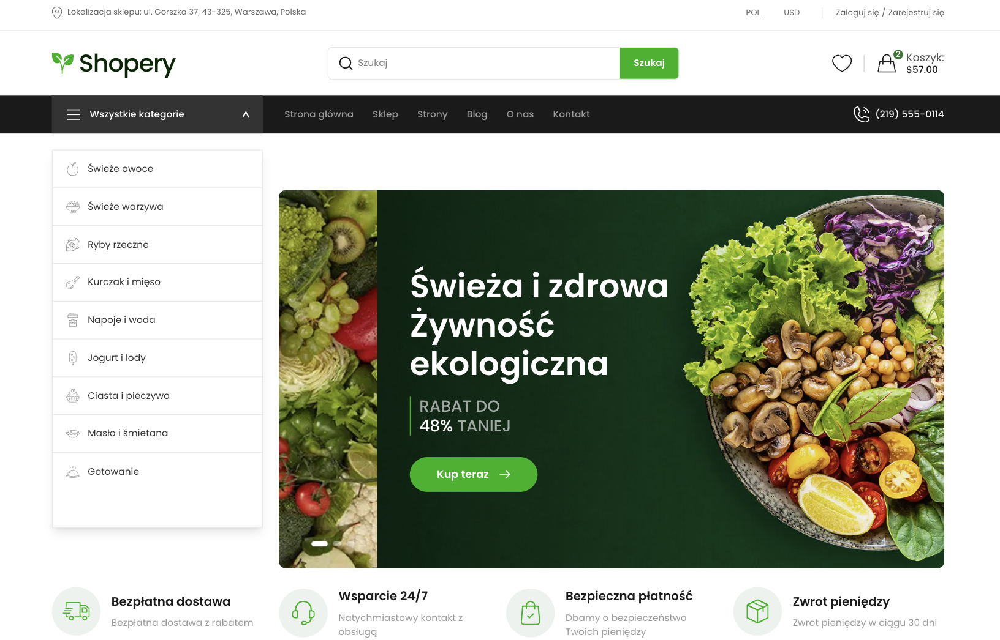
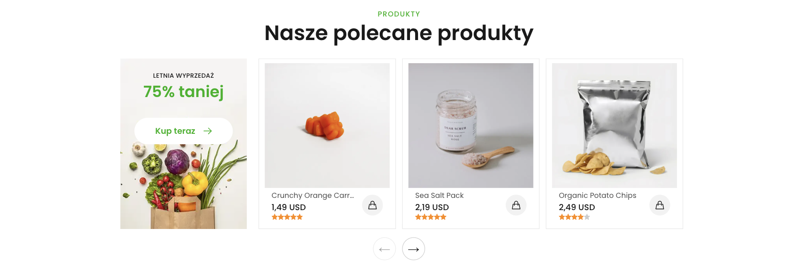
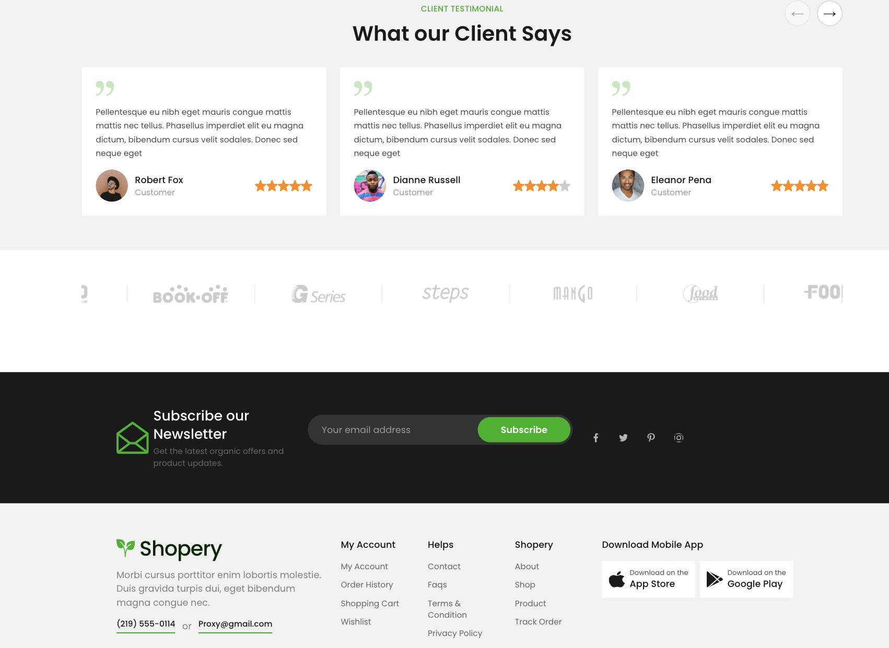
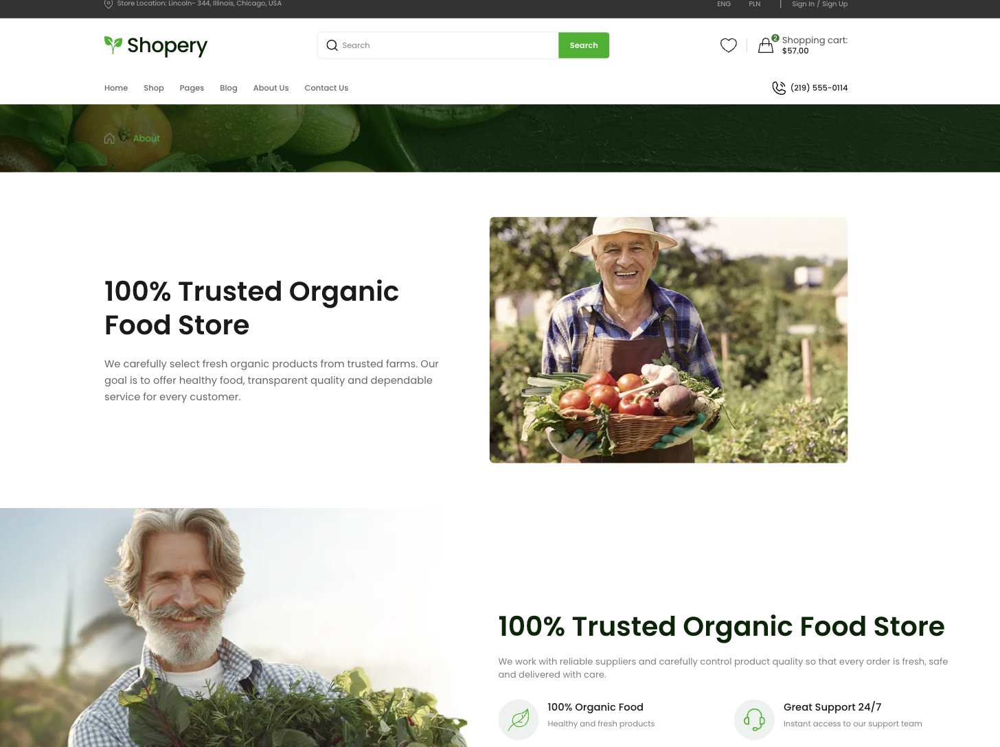
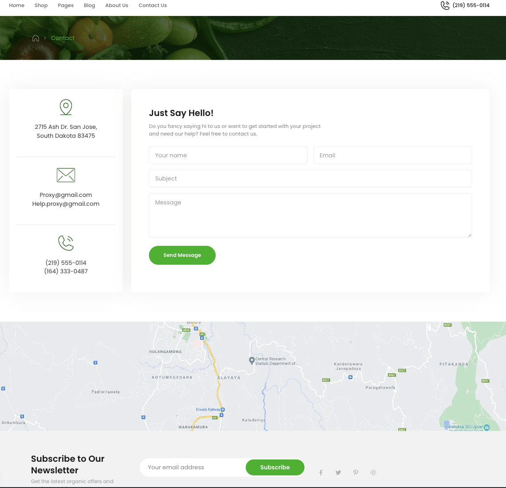
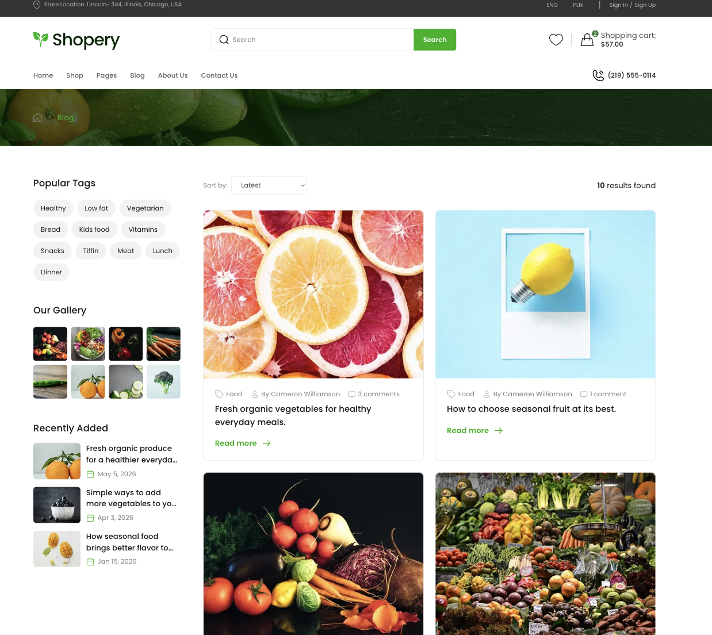
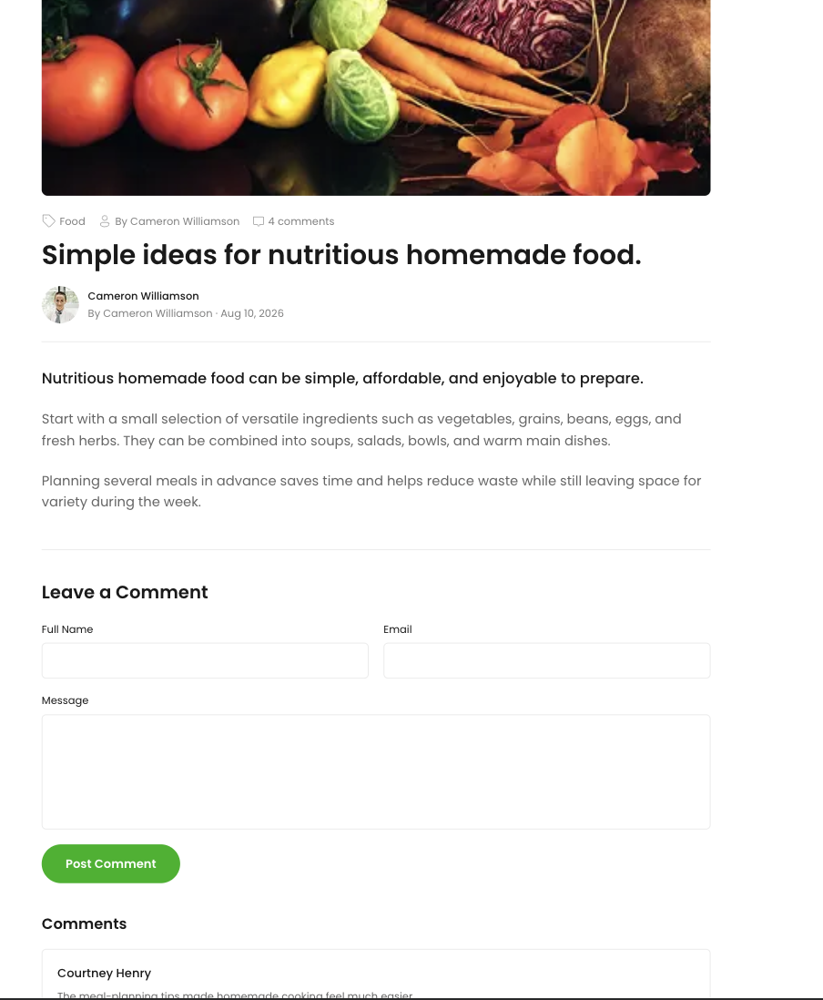

# 🛒 Organic Shop

🚧 **Work in Progress** - this project is currently under active development.

A full-stack e-commerce application built with **Next.js, TypeScript, PostgreSQL, and Drizzle ORM**.

The project is focused on building a realistic online shopping experience using modern frontend and full-stack web technologies.

## 🌐 Live Demo

🔗 [Open Organic Shop](https://organic-shop-snowy.vercel.app/)

---

## ✨ Key Features

### Storefront

- Responsive homepage with hero and product carousels
- Database-driven featured, best-selling, top-rated, and discounted product collections
- USD and PLN price display with a persisted currency preference
- Reusable product cards, promotional banners, ratings, and product collections

### Localization

- English and Polish localization powered by next-intl
- Locale-aware navigation and metadata
- Language switching with preserved URL query parameters
- Localized product titles stored in PostgreSQL

### Blog

- Localized blog listing and article pages
- Sorting by newest, oldest, and popularity
- Tag filtering, pagination, result counts, and empty states
- Browser-persisted mock comments with dynamic comment counts
- Accessible image lightbox with localized image descriptions

### Content Pages

- Responsive About and Contact pages
- Localized contact and newsletter forms with submission feedback
- Team, testimonials, sponsors, benefits, and delivery sections
- Reusable breadcrumbs and inner-page layouts

### Reliability and Accessibility

- Redis stale-while-revalidate caching with runtime validation and refresh locks
- Database fallback when Redis is unavailable
- Responsive and keyboard-accessible navigation and dialogs
- Responsive loading skeletons and localized error and not-found states

---

## 📸 Preview

### Homepage Hero and Navigation

  

### Featured Products

  

### Testimonials and Footer

  

### About and Contact

  
  

### Blog

  
  

---

## 🛠 Tech Stack

### Frontend

- **Next.js 16**
- **React 19**
- **TypeScript**
- **Tailwind CSS 4**
- **next-intl**
- **Zustand**
- **Embla Carousel**

### Backend, Data & Integrations

- **PostgreSQL on Neon**
- **Drizzle ORM**
- **Upstash Redis**
- **Web3Forms**

### Development Tools & Code Quality

- **Git & GitHub**
- **Vercel**
- **ESLint**
- **Prettier**
- **Husky**
- **Codex**

---

## 🚧 Development Status

The project is actively being developed.

Current work includes expanding the e-commerce functionality, improving application architecture and polishing the user experience.

---

## 🎯 Project Goals

This project is focused on gaining practical experience with:

- Full-stack e-commerce architecture
- Database design and integration
- Server and client-side development
- E-commerce workflows
- State and data management
- Responsive UI development
- Performance and maintainability
- Production deployment

---

## 👩‍💻 Author

**Hanna Rogalska**

Frontend Developer focused on **React, TypeScript, Next.js and E-commerce**.
